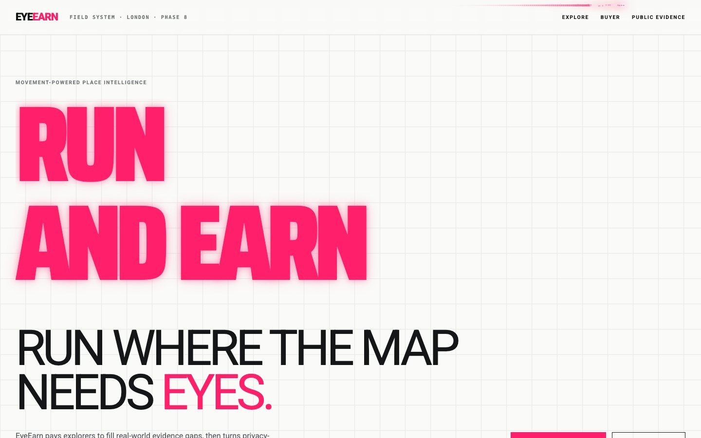
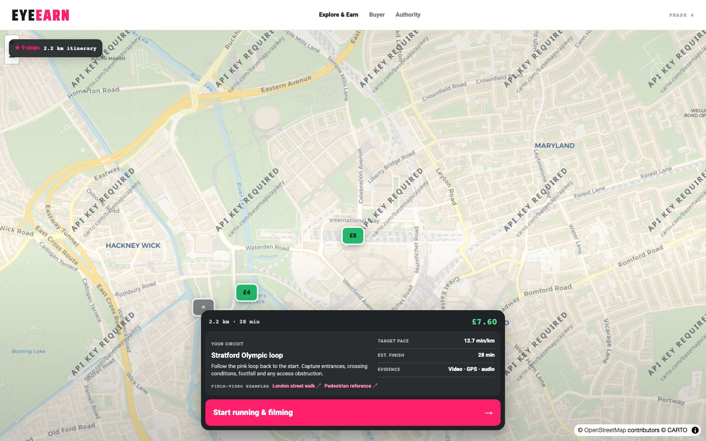
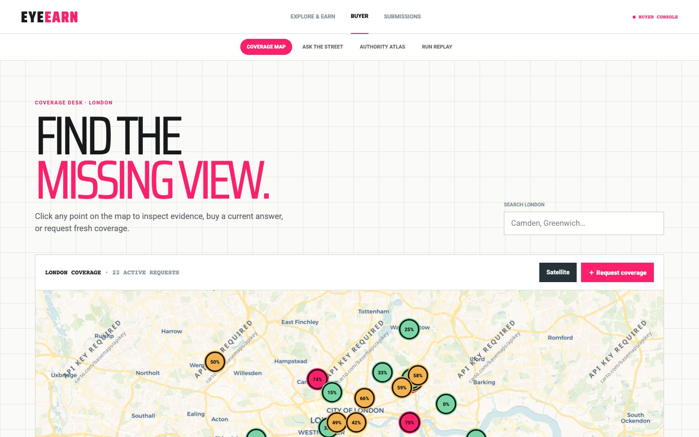
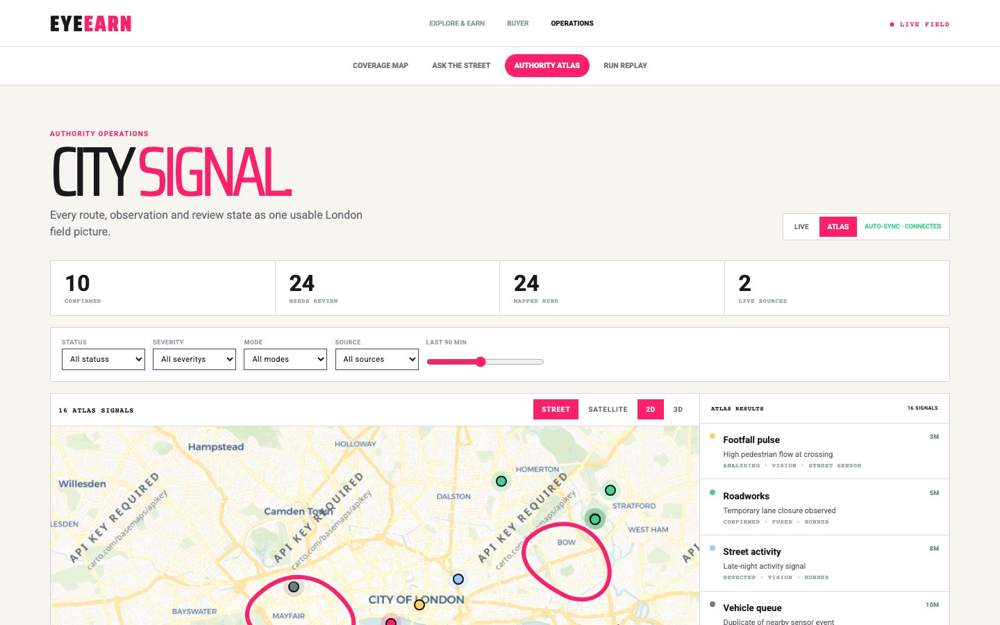
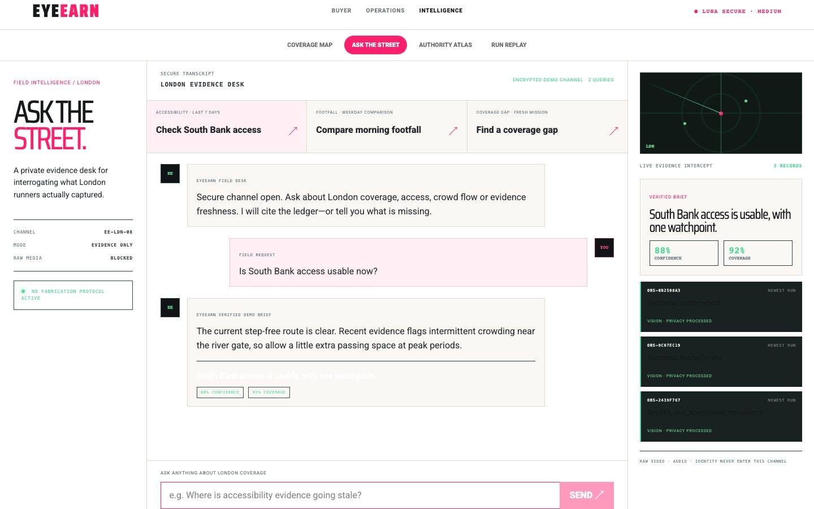
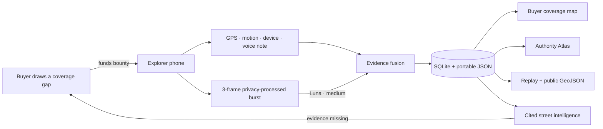
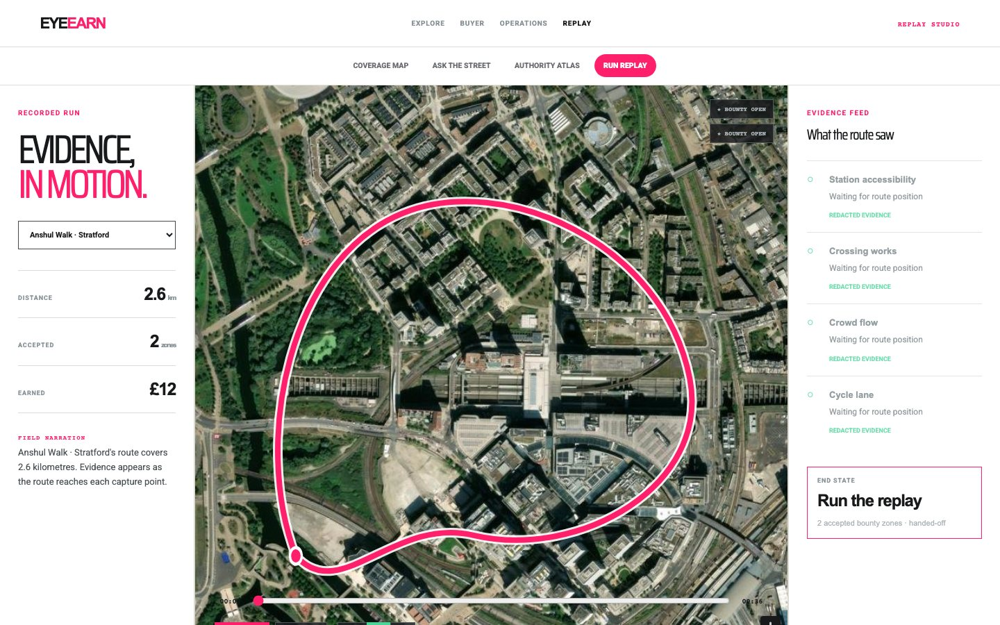

<div align="center">

# 👁️ EyeEarn

### Run where the map needs eyes.

**A privacy-first marketplace that pays people to collect fresh street evidence — then turns it into cited, decision-ready place intelligence.**

[](https://eyeearn.vercel.app)
[](https://nextjs.org)
[](https://www.typescriptlang.org)
[](docs/PRIVACY.md)

**[Try the live demo](https://eyeearn.vercel.app)** · **[Explore & earn](https://eyeearn.vercel.app/explore)** · **[Request coverage](https://eyeearn.vercel.app/buyer)** · **[Public evidence](https://eyeearn.vercel.app/developers)**

</div>

<a href="https://eyeearn.vercel.app">
  
</a>

## The idea

Maps know where roads are. They rarely know what the street is like **right now**.

EyeEarn closes that gap with a simple flywheel:

1. **A buyer requests fresh coverage** of a building, route or area.
2. **A nearby explorer earns a bounty** by walking the prepared itinerary with their phone.
3. **EyeEarn extracts privacy-processed evidence** from location, motion, audio notes, device context and sampled video frames.
4. **Buyers get answers, not footage** — cited observations, confidence, coverage, replays and a city-wide evidence atlas.

> [!IMPORTANT]
> Continuous raw video and ambient audio are not uploaded. The demo samples short frame bursts, applies privacy gates, and stores derived observations instead of a surveillance archive.

## One field network. Four perspectives.

<table>
  <tr>
    <td width="50%">
      
      <br />
      <strong>Explore & Earn</strong><br />
      <sub>Choose a paid evidence gap, see the mission brief, then run and film with live distance, pace and payout.</sub>
    </td>
    <td width="50%">
      
      <br />
      <strong>Buyer Coverage Desk</strong><br />
      <sub>Inspect London coverage or draw a point, circle or rectangle and publish a funded bounty.</sub>
    </td>
  </tr>
  <tr>
    <td width="50%">
      
      <br />
      <strong>Authority Atlas</strong><br />
      <sub>A live god-view of routes, evidence signals, review states, severity, source and freshness.</sub>
    </td>
    <td width="50%">
      
      <br />
      <strong>Ask the Street</strong><br />
      <sub>Ask natural-language questions and receive evidence-grounded answers — or turn a missing answer into a new mission.</sub>
    </td>
  </tr>
</table>

## What already works

- **London-wide bounty map** with selectable missions, payout, distance, pace, capture brief and street/satellite views.
- **Phone capture flow** for camera, microphone, GPS trail, movement, brightness, device context and timed frame bursts.
- **Multimodal evidence fusion** using three privacy-processed frames over roughly one second, analysed as one temporal report every six seconds.
- **Buyer coverage builder** for a building, circular area or rectangular area, including naming, evidence requirements, pricing and demo payment.
- **Cited intelligence chat** with confidence, coverage, method and linked evidence; missing evidence becomes a funded mission instead of a fabricated answer.
- **Authority operations** with live/atlas modes, route trails, mapped observations and status, severity, modality, source and time filters.
- **Recorded run replay** with a seeded *Anshul Walk · Stratford* story, progressive route, evidence reveals, accepted zones and earnings.
- **Public evidence processing lab** that visualizes the capture-to-public pipeline, named recognition stack, voice enrichment and privacy boundary above the bounded GeoJSON API.
- **Portable demo storage** using local SQLite plus a JSON snapshot that seeds serverless deployments.

## The evidence flywheel



## A five-minute judge demo

| Time | Open | Show the magic |
| ---: | --- | --- |
| `0:00` | [Home](https://eyeearn.vercel.app) | The movement-powered marketplace: **run where the map needs eyes**. |
| `0:25` | [Explore](https://eyeearn.vercel.app/explore) | Pick the Stratford bounty, inspect the mission and start the camera/GPS run. |
| `1:20` | [Buyer](https://eyeearn.vercel.app/buyer) | Draw an area, name the evidence request, set a bounty and publish coverage. |
| `2:10` | [Ask the Street](https://eyeearn.vercel.app/intelligence) | Ask about access or footfall; show citations, confidence and gap-to-mission funding. |
| `3:05` | [Authority Atlas](https://eyeearn.vercel.app/operations) | Filter the London signal layer and inspect routes, evidence and review state. |
| `4:00` | [Run Replay](https://eyeearn.vercel.app/replay) | Play *Anshul Walk · Stratford* and watch evidence appear along the route. |
| `4:35` | [Public Evidence](https://eyeearn.vercel.app/developers) | End on the privacy-safe, source-labelled GeoJSON surface. |

<p align="center">
  
</p>

## Privacy is the product boundary

| Collected | Shared with buyers |
| --- | --- |
| GPS path and timestamps | Route coverage and freshness |
| Motion, pace and distance | Quality and completion metrics |
| Device and capture context | Non-identifying capture quality |
| Short voice observations | Scrubbed transcript evidence |
| Sampled video-frame bursts | Derived objects, conditions and confidence |
| Face/plate risk signals | Redacted or held evidence — never raw identity |

The public surface further removes raw media, direct identity and blocked observations. Read the full [privacy model](docs/PRIVACY.md) and [data collection notes](docs/DATA_COLLECTION.md).

## Run it locally

```bash
git clone https://github.com/anshulyadav1976/EyeEarn.git
cd EyeEarn
npm install
npm run dev
```

Open [http://localhost:3000](http://localhost:3000). The core demo works without paid services; AI routes use safe deterministic fallbacks when credentials are absent.

For live inference, add a local `.env.local`:

```dotenv
OPENAI_API_KEY=your_server_side_key
OPENAI_MODEL=gpt-5.6-luna

# Optional voice-token support
ELEVENLABS_API_KEY=your_server_side_key
```

Never expose these values through `NEXT_PUBLIC_*` variables or commit `.env.local`.

## Quality checks

```bash
npm test          # evidence, itinerary, public API and backbone checks
npm run lint      # Next.js / React linting
npm run build     # production build
```

## Stack

| Layer | Choice |
| --- | --- |
| Product | Next.js 16, React 19, TypeScript |
| Maps | MapLibre GL, CARTO and Esri tiles |
| Intelligence | OpenAI Responses API · `gpt-5.6-luna` · medium reasoning |
| Capture | Browser MediaDevices, Geolocation and Speech Recognition fallbacks |
| Local data | Node SQLite + portable JSON snapshot |
| Deployment | Vercel |

## API surface

| Endpoint | Purpose |
| --- | --- |
| `POST /api/analyze-frame` | Privacy-aware temporal vision analysis |
| `GET/POST /api/runs` | Run collection and completion handoff |
| `POST /api/fund` | Publish and fund a buyer bounty |
| `POST /api/intelligence` | Cited evidence questions and gap detection |
| `GET /api/public/v1/evidence` | Bounded public GeoJSON feed |
| `GET /api/storage/export` | Portable demo snapshot |
| `GET /api/health` | Runtime and storage health |

## Project notes

- Local development persists to `.data/phase2.sqlite` and refreshes `.data/phase2.json`.
- Vercel seeds from the JSON snapshot, but runtime filesystem writes are ephemeral. Use the optional schema in [`docs/phase2-schema.sql`](docs/phase2-schema.sql) when durable hosted collection becomes necessary.
- EyeEarn is currently implemented through **Phase 8** of the hackathon build plan and optimized for a five-minute live demo.

Deep dives: [Phase 5–8 demo](docs/PHASE5_8_DEMO.md) · [Storage](docs/STORAGE.md) · [Buyer API](docs/BUYER_API.md) · [Build log](docs/BUILD_LOG.md)

---

<div align="center">

### The world changes faster than its maps. EyeEarn pays people to close the gap.

**[Open EyeEarn →](https://eyeearn.vercel.app)**

</div>
